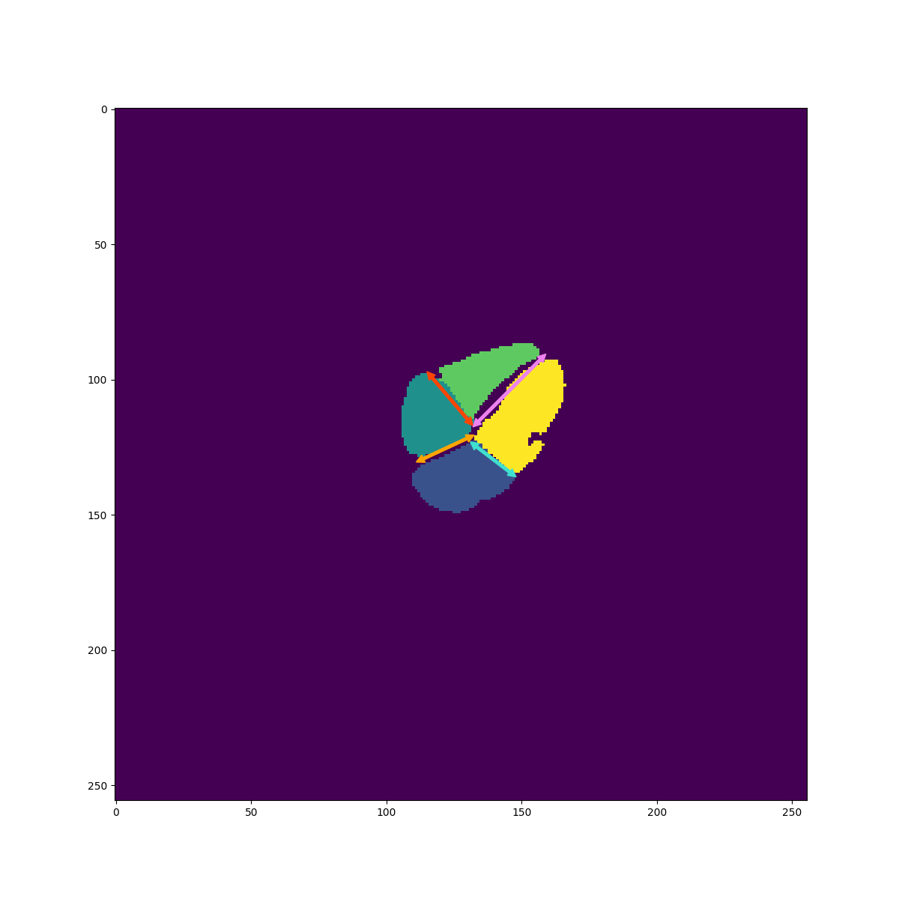
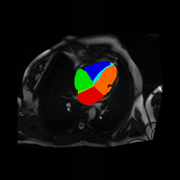
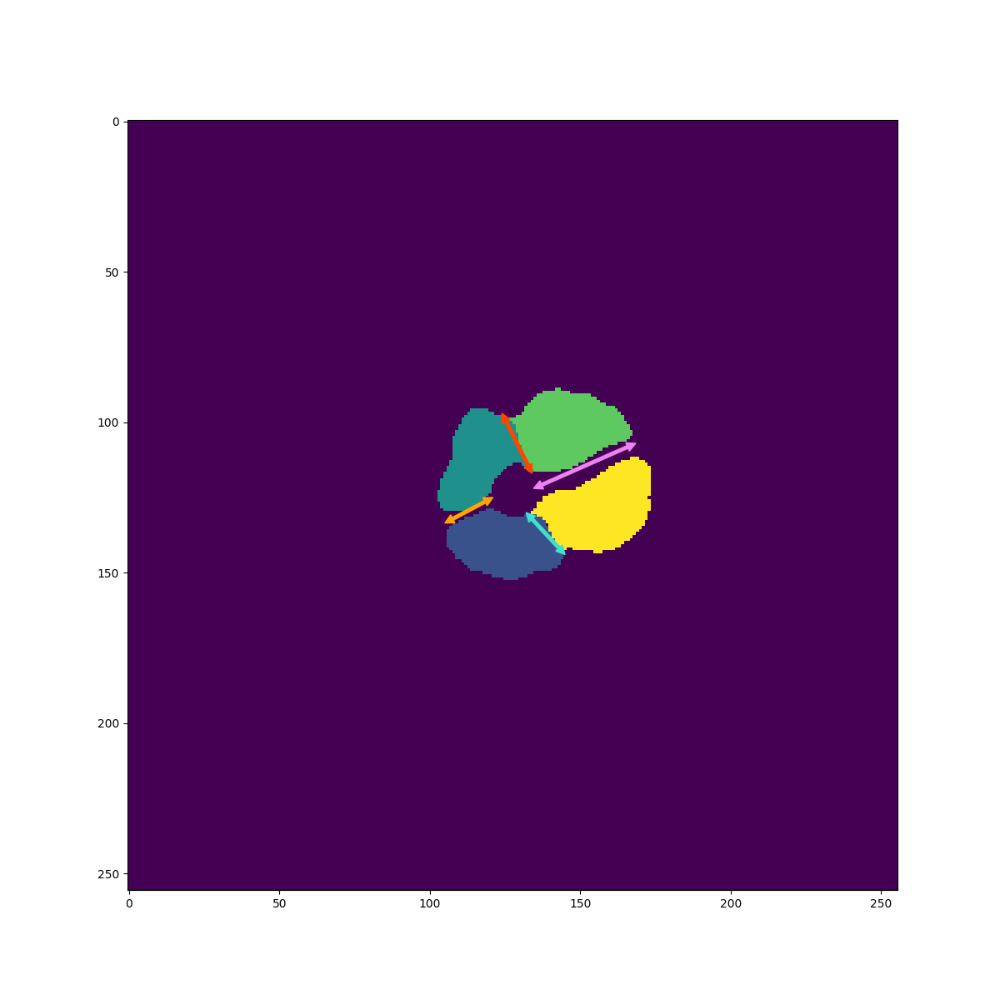
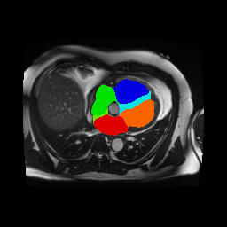
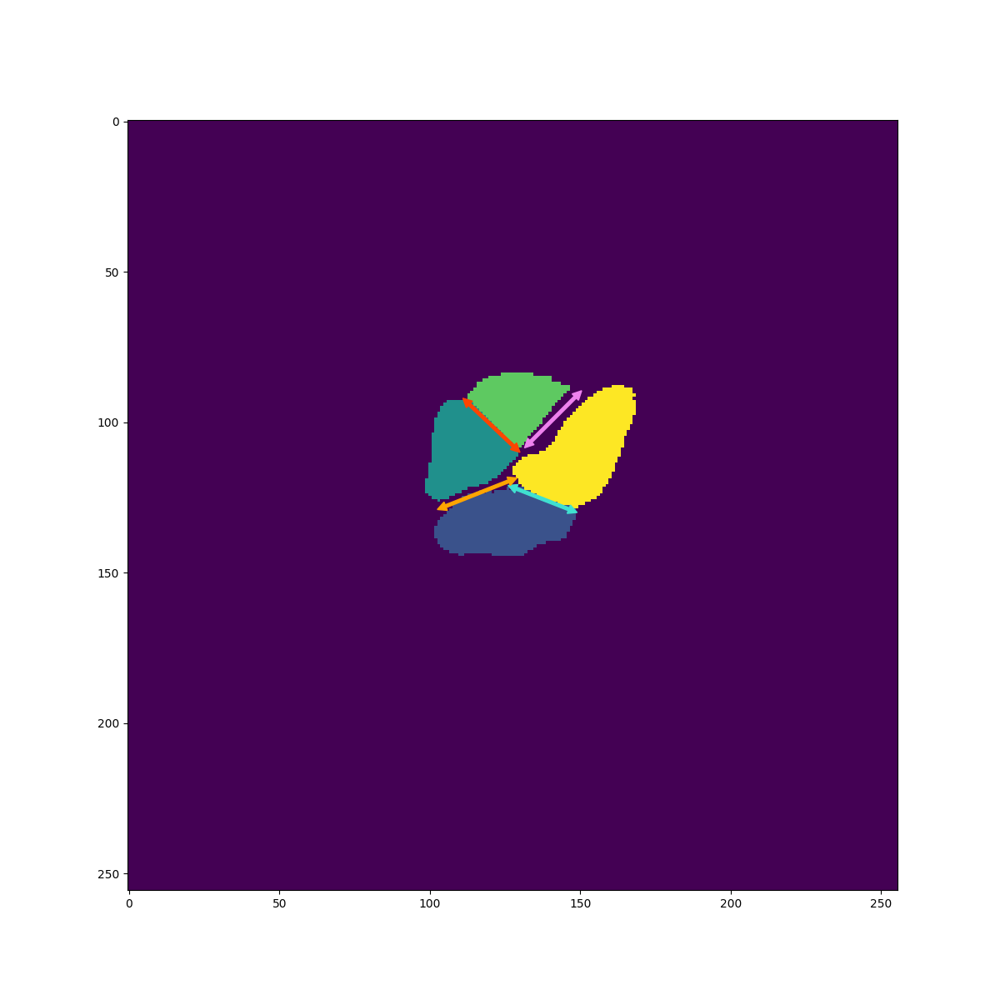
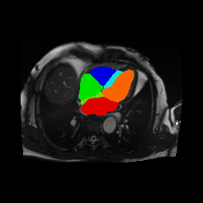

# ukbb_lax_4ch_segmentation
Segmenting long-axis 4-chamber view Cardiac MRI with a U-Net deep convolutional neural network model and measure the dimensions of the 4 chambers.

## Set up the python environment (installing all python package dependencies)
To ensure all required packages are installed, run the following command:
```
pip install -r requirements.txt
```

Package List:
```
backcall==0.2.0
certifi==2021.10.8
charset-normalizer==2.0.7
cycler==0.11.0
decorator==4.4.2
idna==3.3
imageio==2.10.4
kiwisolver==1.3.2
matplotlib==3.4.3
networkx==2.6.3
numpy==1.21.4
opencv-contrib-python-headless==4.5.4.58
pandas==1.3.4
Pillow==8.4.0
pydicom==2.2.2
pyparsing==3.0.6
python-dateutil==2.8.1
pytz==2021.3
PyWavelets==1.2.0
pyzmq==20.0.0
requests==2.26.0
scikit-image==0.18.3
scipy==1.7.2
six==1.15.0
tifffile==2021.11.2
torch==1.10.0
torchvision==0.11.1
tqdm==4.62.3
typing-extensions==3.10.0.2
urllib3==1.26.7
```

## Setup: download the test data and the model weights
Run the `download.py` file, use the following command.
```
python download.py
```

## Running the code with a tutorial
To see the process with a step by step illustration, open the <a href='Tutorial.ipynb' title='Tutorial.ipynb'>`Tutorial.ipynb`</a> notebook with a jupyter server.

## Use the measurement python script
Run the file `measurements/measure_4ch.py` with default arguments will generate the measurements on the test data.
```
python measurements/measure_4ch.py
```
Run the file `measurements/measure_4ch.py` with arguments `--save_fig` and `--csv test_data/labels_savefig.csv` will generate the measuring figures on the test data.
```
python measurements/measure_4ch.py --csv test_data/labels_savefig.csv --savefig
```

## Results
The segmentation of the examples would be like the images shown below:

Example 1:
<p float="left">
  
  
</p>

Example 2:
<p float="left">
  
  
</p>

Example 3:
<p float="left">
  
  
</p>
